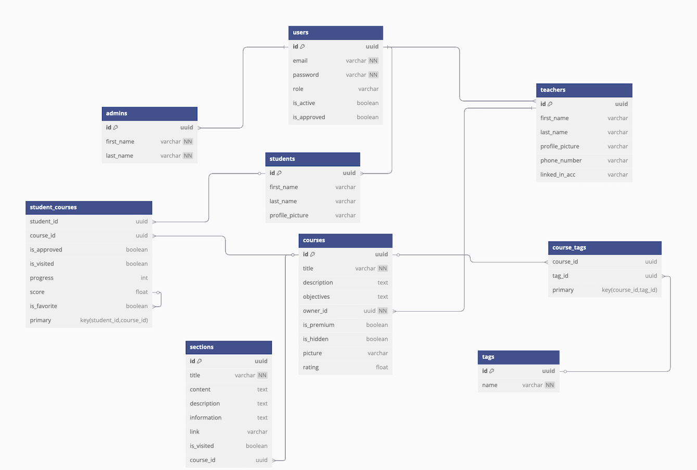

<p align="center">
  
</p>

<h1 align="center">UDI – Unified Digital Instruction Platform</h1>
<p align="center"><i>Created by Uasim, Dimitar, and Ivan</i></p>

---

## 🧭 Introduction

**UDI** is a modern, full-stack e-learning platform built to empower digital education for students, teachers, and administrators. Featuring clean architecture, a responsive design, role-based access, and secure authentication, UDI simplifies the management of learning content, enrollments, and communication across all roles.

---

## ⚙️ Technologies Used

### 🔧 Backend – FastAPI (Python)

* **Framework:** FastAPI, SQLAlchemy, Alembic
* **Database:** PostgreSQL (NeonDB)
* **Authentication:** JWT (OAuth2 password flow)
* **Email Notifications:** Gmail SMTP (`smtplib`, `email.mime.text`)
* **File Storage:** AWS S3 with Boto3
* **Image Processing:** Pillow (PIL)
* **Config Management:** `pydantic-settings`
* **Dependency Management:** `uv` + `pyproject.toml`
* **Testing:** `unittest`
* **Dockerized:** Yes

### 🎨 Frontend – Vue.js

* **Framework:** Vue 3 with Composition API
* **Build Tool:** Vite
* **Router:** Vue Router
* **Styling:** Tailwind CSS
* **UI:** shadcn/vue, lucide-react
* **State/API:** Axios, JWT-decode
* **Docker-ready** with `.env.template` support

---

## 🚀 Getting Started

### Backend Setup

1. **Clone the Repository**

   ```bash
   git clone https://github.com/yourusername/udi.git
   cd udi/backend
   ```

2. **Sync Dependencies with uv**

   ```bash
   uv venv
   uv pip install -r requirements.txt
   ```

3. **Environment Configuration**

   ```bash
   cp .env.template .env
   ```

   Update credentials and values for:

   * `JWT_SECRET_KEY`, `DATABASE_URL`, SMTP, AWS, etc.

4. **Run Database Migrations**

   ```bash
   alembic upgrade head
   ```

5. **Start the Server**

   ```bash
   uvicorn src.main:app --reload
   ```

Or via Docker Compose:

```bash
docker compose up --build
```

---

### Frontend Setup

1. **Navigate to the Frontend**

   ```bash
   cd ../frontend
   ```

2. **Install Node Modules**

   ```bash
   npm install
   ```

3. **Environment Configuration**

   ```bash
   cp .env.template .env
   ```

   Edit `VITE_API_URL=http://localhost:8000`

4. **Run the Frontend Dev Server**

   ```bash
   npm run dev
   ```

Or via Docker:

```bash
docker compose up --build
```

---

## ✨ Key Features

### 👨‍🎓 Students

* Register, upload profile pictures
* Enroll in public/premium courses
* View content, rate courses
* Track progress and favorites

### 👩‍🏫 Teachers

* Register and await admin approval
* Create and manage courses and sections
* Approve student enrollments
* Get notified via email

### 🛡️ Admins

* Approve or reject teachers
* Manage users and course visibility
* Access all ratings and enrollment data

### 🌐 System-wide

* Secure role-based access with JWT
* Email approval and notification flow
* File/image handling via AWS S3
* Theme switching (light/dark)
* Fully containerized (Docker)

---

## 🗃️ Database Schema

<p align="center">
  
</p>

---

## 🧪 Running Tests

```bash
python -m unittest discover tests
```

**Test Coverage Includes:**

* User workflows (register/login)
* Admin approval and activation
* Email token generation and validation
* Secure token handling

---

## 📁 Project Structure

```
udi/
├── backend/
│   ├── src/
│   │   ├── api/
│   │   ├── core/
│   │   ├── crud/
│   │   ├── models/
│   │   ├── schemas/
│   │   ├── utils/
│   │   └── main.py
│   ├── .env.template
│   └── tests/
├── frontend/
│   ├── components/
│   ├── layouts/
│   ├── pages/
│   ├── .env.template
│   └── App.vue
├── docker-compose.yml
└── public/
    ├── UDI_logo.png
    └── diagram.png
```

---

## 📌 Final Notes

UDI is a secure, scalable e-learning solution designed for real-world deployments. It emphasizes:

* Modern dev practices with `uv` and Docker
* Centralized role and permission management
* Fully testable and extendable design

Built by Uasim, Dimitar, and Ivan with ❤️ for modern digital education.
